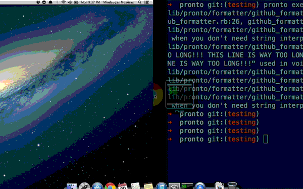

# Pronto

[](http://travis-ci.org/prontolabs/pronto)
[](https://codeclimate.com/github/prontolabs/pronto)
[](https://codeclimate.com/github/prontolabs/pronto)
[](http://badge.fury.io/rb/pronto)
[](http://inch-ci.org/github/prontolabs/pronto)

**Pronto** runs analysis quickly by checking only the relevant changes. Created to
be used on [GitHub pull requests](#github-integration), but also works [locally](#local-changes) and integrates with [GitLab](#gitlab-integration) and [Bitbucket](#bitbucket-integration).
Perfect if you want to find out quickly if a branch introduces changes that conform
to your [styleguide](https://github.com/prontolabs/pronto-rubocop), [are DRY](https://github.com/prontolabs/pronto-flay), [don't introduce security holes](https://github.com/prontolabs/pronto-brakeman) and [more](#runners).



_This README might be ahead of the latest release. Find the README for v0.9.2 [here](https://github.com/prontolabs/pronto/blob/v0.9.2/README.md)._

* [Installation](#installation)
* [Usage](#usage)
    * [Local Changes](#local-changes)
    * [GitHub Integration](#github-integration)
    * [GitLab Integration](#gitlab-integration)
    * [Bitbucket Integration](#bitbucket-integration)
* [Configuration](#configuration)
* [Runners](#runners)
* [Articles](#articles)
* [Changelog](#changelog)
* [Copyright](#copyright)

## Installation

**Pronto**'s installation is standard for a Ruby gem:

```sh
$ gem install pronto
```

You'll also want to install some [runners](#runners) to go along with the main gem:

```sh
$ gem install pronto-rubocop
$ gem install pronto-flay
```

If you'd rather install Pronto using `bundler`, you don't need to require it,
unless you're gonna run it from Ruby (via Rake task, for example):

```ruby
gem 'pronto'
gem 'pronto-rubocop', require: false
gem 'pronto-flay', require: false
```

## Usage

Pronto runs the checks on a diff between the current HEAD and the provided commit-ish (default is master).

### Local Changes

Navigate to the repository you want to run Pronto on, and:

```sh
git checkout feature/branch

# Analyze diff of committed changes on current branch and master:
pronto run

# Analyze changes in git staging area
pronto run --staged

# Analyze diff of uncommitted changes and master:
pronto run --unstaged

# Analyze *all* changes since the *initial* commit (may take some time):
pronto run --commit=$(git log --pretty=format:%H | tail -1)
```

Just run `pronto` without any arguments to see what Pronto is capable of.

Available Options

| Command flag      | Description                                                 |
|:------------------|:------------------------------------------------------------|
| `--exit-code`     | Exits with non-zero code if there were any warnings/errors. |
| `-c/--commit`     | Commit for the diff.                                        |
| `--staged`        | Analyze changes in git staging area                         |
| `--unstaged`      | Analyze changes made, but not in git staging area           |
| `-r/--runner`     | Run only the passed runners.                                |
| `-f/--formatters` | Pick output formatters.                                     |

### GitHub Integration

You can run Pronto as a step of your CI builds and get the results as comments
on GitHub commits using `GithubFormatter` or `GithubPullRequestFormatter`.

Add Pronto runners you want to use to your Gemfile:

Set the PRONTO_GITHUB_ACCESS_TOKEN environment variable or value in `.pronto.yml` to
[OAuth token](https://help.github.com/articles/creating-an-access-token-for-command-line-use) that has access to the repository.

Then just run it:

```sh
$ PRONTO_GITHUB_ACCESS_TOKEN=token pronto run -f github -c origin/master
```

If you want comments to appear on pull request diff, instead of commit:

```sh
$ PRONTO_GITHUB_ACCESS_TOKEN=token pronto run -f github_pr -c origin/master
```

If you want review to appear on pull request diff, instead of separate comments:

```sh
$ PRONTO_GITHUB_ACCESS_TOKEN=token pronto run -f github_pr_review -c origin/master
```

All the **N** pending comments will be now separated into **X** number of PR reviews.
The number of the PR reviews will be controlled by an additional environment variable or with the help of a config setting.
This way, by a single pronto run, all the comments will be published to the PR, but divided into small reviews
in order to avoid the rate limit of the providers.

```
X = N / {PRONTO_WARNINGS_PER_REVIEW || warnings_per_review || 30})
```

Note: In case no environment variable or config setting is specified in `.pronto.yml`,
      a default value of `30` will be used.

```sh
$ PRONTO_WARNINGS_PER_REVIEW=30 PRONTO_GITHUB_ACCESS_TOKEN=token pronto run -f github_pr_review -c origin/master
```

Use `GithubStatusFormatter` to submit [commit status](https://github.com/blog/1227-commit-status-api):

```sh
$ PRONTO_GITHUB_ACCESS_TOKEN=token pronto run -f github_status -c origin/master
```

If you want to show a one single status for all runners, instead of status per runner:

```sh
$ PRONTO_GITHUB_ACCESS_TOKEN=token pronto run -f github_combined_status -c origin/master
```

It's possible to combine multiple formatters.
To get both pull request comments and commit status summary use:

```sh
$ PRONTO_GITHUB_ACCESS_TOKEN=token PRONTO_PULL_REQUEST_ID=id pronto run -f github_status github_pr -c origin/master
```

As an alternative, you can also set up a rake task:

```ruby
Pronto::GemNames.new.to_a.each { |gem_name| require "pronto/#{gem_name}" }

formatter = Pronto::Formatter::GithubFormatter.new # also possible: GithubPullRequestFormatter, GithubPullRequestReviewFormatter
status_formatter = Pronto::Formatter::GithubStatusFormatter.new
formatters = [formatter, status_formatter]
Pronto.run('origin/master', '.', formatters)
```

#### GitHub Actions Integration

You can also run Pronto as a GitHub action.

Here's an example `.github/workflows/pronto.yml` workflow file using the `github_status` and `github_pr` formatters and running on each GitHub PR, with `pronto-rubocop` as the runner:


```yml
name: Pronto
on: [pull_request]

jobs:
  pronto:

    runs-on: ubuntu-latest

    steps:
      - name: Checkout code
        uses: actions/checkout@v2
      - run: |
          git fetch --no-tags --prune --depth=10 origin +refs/heads/*:refs/remotes/origin/*
      - name: Setup Ruby
        uses: ruby/setup-ruby@v1
      - name: Setup pronto
        run: gem install pronto pronto-rubocop
      - name: Run Pronto
        run: pronto run -f github_status github_pr -c origin/${{ github.base_ref }}
        env:
          PRONTO_PULL_REQUEST_ID: ${{ github.event.pull_request.number }}
          PRONTO_GITHUB_ACCESS_TOKEN: "${{ github.token }}"
```
check Wiki on [GitHub Actions Integration](https://github.com/prontolabs/pronto/wiki/GitHub-Actions-Integration) for more info.

### GitLab Integration

You can run Pronto as a step of your CI builds and get the results as comments
on GitLab commits using `GitlabFormatter`.

**note: this requires at least GitLab v7.5.0**

Set the `PRONTO_GITLAB_API_ENDPOINT` environment variable or value in `.pronto.yml` to
your API endpoint URL. If you are using Gitlab.com's hosted service your
endpoint will be set by default.
Set the `PRONTO_GITLAB_API_PRIVATE_TOKEN` environment variable or value in `.pronto.yml`
to your Gitlab private token which you can find in your account settings.

Then just run it:

```sh
$ PRONTO_GITLAB_API_PRIVATE_TOKEN=token pronto run -f gitlab -c origin/master
```

**note: this requires at least Gitlab 11.6+**

Merge request integration:

```sh
$ PRONTO_GITLAB_API_PRIVATE_TOKEN=token PRONTO_PULL_REQUEST_ID=id pronto run -f gitlab_mr -c origin/master
```

On GitLabCI, make sure to run Pronto in a [merge request pipeline](https://docs.gitlab.com/ce/ci/merge_request_pipelines/):

```yml
lint:
  image: ruby
  variables:
    PRONTO_GITLAB_API_ENDPOINT: "https://gitlab.com/api/v4"
    PRONTO_GITLAB_API_PRIVATE_TOKEN: token
  only:
    - merge_requests
  script:
    - bundle install
    - bundle exec pronto run -f gitlab_mr -c origin/$CI_MERGE_REQUEST_TARGET_BRANCH_NAME
```

### Bitbucket Integration

You can run Pronto as a step of your CI builds and get the results as comments
on Bitbucket commits using `BitbucketFormatter` or `BitbucketPullRequestFormatter`.

Add Pronto runners you want to use to your Gemfile:

Set the PRONTO_BITBUCKET_USERNAME and PRONTO_BITBUCKET_PASSWORD environment variables or values in `.pronto.yml`.

Then just run it:

```sh
$ PRONTO_BITBUCKET_USERNAME=user PRONTO_BITBUCKET_PASSWORD=pass pronto run -f bitbucket -c origin/master
```

or, if you want comments to appear on pull request diff, instead of commit:

```sh
$ PRONTO_BITBUCKET_USERNAME=user PRONTO_BITBUCKET_PASSWORD=pass pronto run -f bitbucket_pr -c origin/master
```

## Configuration

The behavior of Pronto can be controlled via the `.pronto.yml` configuration
file. It can either be placed in the working directory (*) or specified using
the environment variable `PRONTO_CONFIG_FILE`.

(*) The working directory is where you run the command from, which is typically
your project directory.

If this file cannot be found, then the default configuration in
[Pronto::ConfigFile::EMPTY](lib/pronto/config_file.rb) applies.

The file has the following format:

```yaml
all:
  exclude:
    - 'spec/**/*'
# exclude files for single runner
eslint:
  exclude:
    - 'app/assets/**/*'
github:
  slug: prontolabs/pronto
  access_token: B26354
  api_endpoint: https://api.github.com/
  web_endpoint: https://github.com/
gitlab:
  slug: 1234567 # gitlab's project ID
  api_private_token: 46751
  api_endpoint: https://api.vinted.com/gitlab
bitbucket:
  slug: prontolabs/pronto
  username: user
  password: pass
  web_endpoint: https://bitbucket.org/
max_warnings: 150
warnings_per_review: 30
verbose: false
runners: [rubocop, eslint] # only listed runners will be executed
skip_runners: [reek] # all, except listed runners will be executed
```

All properties that can be specified via `.pronto.yml`, can also be specified
via environment variables. Their names will be the upcased path to the property.
For example: `PRONTO_GITHUB_SLUG` or `PRONTO_GITLAB_API_PRIVATE_TOKEN`. Environment variables
will always take precedence over values in configuration file.

| Property              | Description                                                                          |
|-----------------------|--------------------------------------------------------------------------------------|
| `max_warnings`        | Limits the amount of warnings. Returns all warnings if option is skipped.            |
| `runners`             | Runs only listed runners. Runs everything if option is skipped.                      |
| `skip_runners`        | All, except listed runners will be executed. Runs everything if option is skipped.   |
| `verbose`             | Outputs more information when set to `true`.                                         |
| `warnings_per_review` | Limits the amount of warnings per review. Returns all warnings if option is skipped. |

### Message format

Pronto allows you to configure the format of the messages that are produced. You
can set a default format that will be used by all formatters, or you can
configure a separate format per formatter, if you are using several.

To change the default format:

```yaml
format: "%{runner} %{level} %{msg}"
```

To add the title of the Runner to the GitHub Pull Request formatter only:

```yaml
github_pr:
  format: "%{runner} - %{msg}"
```

The available values to be interpolated into the message are:

| Key          | Description    |
|--------------|----------------|
| `path`       | File path.     |
| `line`       | Line number.   |
| `level`      | Message level. |
| `msg`        | Message.       |
| `commit_sha` | SHA.           |
| `runner`     | Runner name.   |

The following values are available only to the text formatter:

| Key              | Description              |
|------------------|--------------------------|
| `color_level`    | Colorized message level. |
| `color_location` | Colorized location.      |

## Runners

Pronto can run various tools and libraries, as long as there's a runner for it.
Currently available:

* [pronto-bigfiles](https://github.com/apiology/pronto-bigfiles)
* [pronto-blacklist](https://github.com/pbstriker38/pronto-blacklist)
* [pronto-brakeman](https://github.com/prontolabs/pronto-brakeman)
* [pronto-checkstyle](https://github.com/seikichi/pronto-checkstyle)
* [pronto-coffeelint](https://github.com/siebertm/pronto-coffeelint)
* [pronto-clang_format](https://github.com/micjabbour/pronto-clang_format)
* [pronto-clang_tidy](https://github.com/micjabbour/pronto-clang_tidy)
* [pronto-clippy](https://github.com/hauleth/pronto-clippy)
* [pronto-credo](https://github.com/carakan/pronto-credo)
* [pronto-dialyxir](https://github.com/Apelsinka223/pronto-dialyxir)
* [pronto-dialyzer](https://github.com/iurifq/pronto-dialyzer)
* [pronto-dirty_words](https://github.com/kevinjalbert/pronto-dirty_words)
* [pronto-dogma](https://github.com/iurifq/pronto-dogma)
* [pronto-erb_lint](https://github.com/tleish/pronto-erb_lint)
* [pronto-eslint](https://github.com/prontolabs/pronto-eslint) (uses [eslintrb](https://github.com/zendesk/eslintrb))
* [pronto-eslint_npm](https://github.com/doits/pronto-eslint_npm) (uses eslint installed from npm)
* [pronto-fasterer](https://github.com/prontolabs/pronto-fasterer)
* [pronto-findbugs](https://github.com/seikichi/pronto-findbugs)
* [pronto-flake8](https://github.com/scoremedia/pronto-flake8)
* [pronto-flay](https://github.com/prontolabs/pronto-flay)
* [pronto-flow](https://github.com/kevinjalbert/pronto-flow)
* [pronto-foodcritic](https://github.com/prontolabs/pronto-foodcritic)
* [pronto-goodcheck](https://github.com/aergonaut/pronto-goodcheck)
* [pronto-haml](https://github.com/prontolabs/pronto-haml)
* [pronto-hlint](https://github.com/fretlink/pronto-hlint/) (uses Haskell code suggestions [hlint](https://github.com/ndmitchell/hlint))
* [pronto-infer](https://github.com/seikichi/pronto-infer)
* [pronto-inspec](https://github.com/stiller-leser/pronto-inspec)
* [pronto-jscs](https://github.com/spajus/pronto-jscs)
* [pronto-jshint](https://github.com/prontolabs/pronto-jshint)
* [pronto-json](https://github.com/deees/pronto-json)
* [pronto-luacheck](https://github.com/seikichi/pronto-luacheck)
* [pronto-perl_lint](https://github.com/bells17/pronto-perl_lint)
* [pronto-phpcs](https://github.com/EllisV/pronto-phpcs)
* [pronto-phpmd](https://github.com/EllisV/pronto-phpmd)
* [pronto-phpstan](https://github.com/Powerhamster/pronto-phpstan)
* [pronto-poper](https://github.com/prontolabs/pronto-poper)
* [pronto-punchlist](https://github.com/apiology/pronto-punchlist)
* [pronto-rails_best_practices](https://github.com/prontolabs/pronto-rails_best_practices)
* [pronto-rails_data_schema](https://github.com/mbajur/pronto-rails_data_schema)
* [pronto-rails_schema](https://github.com/raimondasv/pronto-rails_schema)
* [pronto-reek](https://github.com/prontolabs/pronto-reek)
* [pronto-rubocop](https://github.com/prontolabs/pronto-rubocop)
* [pronto-scss](https://github.com/prontolabs/pronto-scss)
* [pronto-shellcheck](https://github.com/pclalv/pronto-shellcheck)
* [pronto-slim](https://github.com/nysthee/pronto-slim)
* [pronto-slim_lint](https://github.com/ibrahima/pronto-slim_lint)
* [pronto-sorbet](https://github.com/teamsimplepay/pronto-sorbet)
* [pronto-spell](https://github.com/prontolabs/pronto-spell)
* [pronto-standardrb](https://github.com/julianrubisch/pronto-standardrb)
* [pronto-stylelint](https://github.com/kevinjalbert/pronto-stylelint)
* [pronto-swiftlint](https://github.com/ajanauskas/pronto-swiftlint)
* [pronto-tailor](https://github.com/ajanauskas/pronto-tailor)
* [pronto-textlint](https://github.com/seikichi/pronto-textlint)
* [pronto-tslint_npm](https://github.com/eprislac/pronto-tslint_npm)
* [pronto-yamllint](https://github.com/pauliusm/pronto-yamllint)
* [pronto-undercover](https://github.com/grodowski/pronto-undercover)
* [pronto-xmllint](https://github.com/pauliusm/pronto-xmllint)

## Articles

Articles to help you to get started:

* [Effortless Code Conventions Review for Pull Request Changes](https://jtway.co/effortless-code-review-for-pull-request-changes-241206b1cb04)
* [Automating code review with Pronto (and friends)](http://everydayrails.com/2015/02/17/pronto-ruby-code-review.html)
* [Setup Pronto with CircleCI](https://medium.com/@MaximAbramchuk/circleci-github-pr-commenting-ruby-scss-coffeescript-javascript-git-and-etc-fbcbe2a378a5#.gk5f14p3j)
* [Continuous Static Analysis using Pronto](http://codingfearlessly.com/2014/11/06/continuous-static-analysis/)
* [Pronto and git hooks](http://elliotthilaire.net/gem-pronto-and-git-hooks/)
* [How to end fruitless dev discussions about your project’s code style?](https://medium.com/appaloosa-store-engineering/how-to-end-fruitless-dev-discussions-about-your-project-s-code-style-245070bff6d4)
* [Free automated code reviews using Pronto](https://hovancik.net/blog/2016/04/11/free-automated-code-reviews-using-pronto/)
* [Automated Elixir code review with Github, Credo and Travis CI](https://medium.com/fazibear/automated-elixir-code-review-with-github-credo-and-travis-ci-986cd56b8f02)
* [Running Rubocop before git commit](https://web.archive.org/web/20181225040512/https://christoph.luppri.ch/articles/code-quality/running-rubocop-before-git-commit/)
* [Pronto, Codeship and GitHub for automatic code review](http://abinoam.tl1n.com/pronto-codeship-and-github-for-automatic-code-review/)
* [How to automatically review your PRs for style violations with Pronto and RuboCop](https://christoph.luppri.ch/how-to-automatically-review-your-prs-for-style-violations-with-pronto-and-rubocop)
* [Create your own Pronto Runner](https://kevinjalbert.com/create-your-own-pronto-runner/)
* [Make Code Reviews A Little Bit Better With Automation](https://medium.com/jimmy-farrell/make-codes-reviews-a-little-bit-better-with-automation-35640df08a62)
* [Stop shipping untested Ruby code with undercover](https://medium.com/futuredev/stop-shipping-untested-ruby-code-with-undercover-1edc963be4a6)
* [Automatic code review with Pronto and GitHub Actions](https://everydayrails.com/2021/05/29/pronto-github-actions-code-quality.html)

Make a Pull Request to add something you wrote or found useful.

## Changelog

**Pronto**'s changelog is available [here](CHANGELOG.md).

## Copyright

Copyright (c) 2013-2018 Mindaugas Mozūras. See [LICENSE](LICENSE) for further details.
